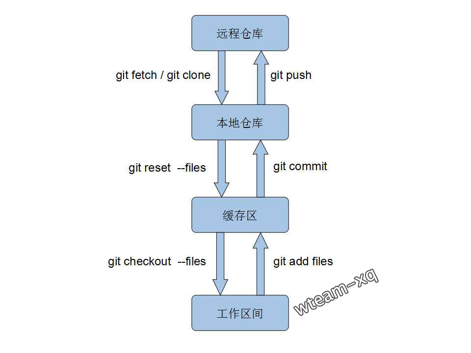

# 一、常用命令
|    命令   |	描述		|
|:-----------------|:--------------------:|
| git clone [url]|将远程仓库的代码克隆到当前目录|
|||
| git init|初始化仓库|
|||
|git status|查看状态|
|||
|git add [file]|将file文件的修改添加到缓存|
|git add .|将所有文件的修改添加到缓存|
|||
|git commit -m 'xxx'|提交|
|git commit - - amend|撤销提交（两个 - 之间没有空格）|
|||
|git log|查看提交历史|
|git reflog|查看命令历史|
|||
|git brach|查看分支列表
|git branch a|从当前分支另外再新建一个分支
|git branch -d| 删除分支
|git branch -D| 强制删除分支
|||
|git checkout a|切换到a分支
|git checkout -b a|新建并切换（git branch a   +   git checkout a）
|||
|git checkout v1.0|切换到v1.0标签
|git checkout - - filename|误删的情况下返回源文件（两个 - 之间没有空格）
|||
|git stash|将当前的修改暂存起来 （git add 过的也可以）
|git stash list |查看缓存列表
|git stash apply|恢复暂存
|git stash drop |删除暂存
|git stash pop |恢复并删除（git stash apply  +  git stash drop）
|||
|git merge develop |将develop 分支合并到当前分支
|git tag v1.0| 将当前分支新建一个标签

# 二、基本提交流程

A 开发 添加一段代码 
```
git add .  
git commit -m '添加一段代码'  
git pull origin <branchName>  
git push origin <branchName>  
```

B 开发 添加两端代码 
```
git add .  
git commit -m '添加两端代码 '  
git pull origin <branchName>  
如果有冲突，解决冲突后 git commit -m '合并冲突'  
git push origin <branchName>  
```

# 三、常用分支

- master  : 永远处在即将发布状态  
- develop : 最新的开发状态  
- release : 准备要发布版本的分支, 用来修复 bug, 基于 develop, 完成后	 merge 回 develop 和 master
- feature : 开发新功能的分支 ，基于 develop 完成后 merge 回 develop 
- hotfix  : 修复线上 bug 基于 master ，修复后 merge 回 develop、master  

> master、develop 用于存在，其他分支可根据情况临时 新建 或 移除

# 四、实践
背景：一个项目负责人 X 先生，两个程序员 A 和 B

### 4.1: 开发新功能
第一步：X 先生
```
1. git checkout develop ( 新功能一定要基于 develop 分支 )
2. git branch featureA ( 新建一个分支用来开发新功能 )
3. git push origin featureA （ 新分支推上去 ）
4. 通知 A、B 拉 featureA 这个分支，并在上面开发新功能  
```

第二步：A、B 
```
1. git pull && git checkout featureA ( 拉取代码、并切换到 featureA 分支 )
2. 开发新功能 按照《多人协作》的步骤 -> 将代码 push 到 featureA 分支
与此同于 X 先生 、A、B、都可以基于 featureA 打测试包, 直到 featureA 基本没有 bug
```

第三步：X 先生
```
1. git checkout develop
2. git merge featureA ( 合并的时候如果有冲突，可以一起看下这个冲突，并解决 )
3. git branch -D featureA (  *删除这个分支之前，确认A、B已经没有需要提交的代码* *一定要通知这个分支所有的相关人员* )  
3. 可以基于 develop 打测试包
```
> 为什么要开一个新的分支去开发新的功能？

### 4.2: 此时状态：已经是基本没什么问题，但是进行最后的测试时，发现 bug
```
1. git checkout develop ( 一定要基于 develop 分支 )
2. git branch release ( 新建一个分支用来修复 bug )  
3. git pull && git checkout release  
4. 修bug、测试、修bug、测试。。。。直到测试ok达到了发布的标准
5. git checkout develop | git merge release
6. git checkout master  | git merge release
7. 基于 master 打包发布
```

### 4.3: 出现紧急bug
```
1. git checkout master 
2. git branch hotfix 
3. git pull && git checkout hotfix  
4. 修bug、测试、修bug、测试。。。。直到测试ok达到了发布的标准
5. git checkout develop | git merge hotfix
6. git checkout master  | git merge hotfix
7. 基于 master 打包发布
```

### 4.4: 情景再现
```
- 今日影视：新版API接入的同时，需要根据旧版API的代码改bug、新增需求后更新版本，同时代码更新到新版API的代码
- 闪电下载器：需要接入新的链接过滤 SDK，但是有可能还要还原回旧的过滤方式
```

# 五、注意事项
push 之前没有 pull

# 六、扩展
利用 Github 将 Module 以依赖的方式接入项目
https://jitpack.io